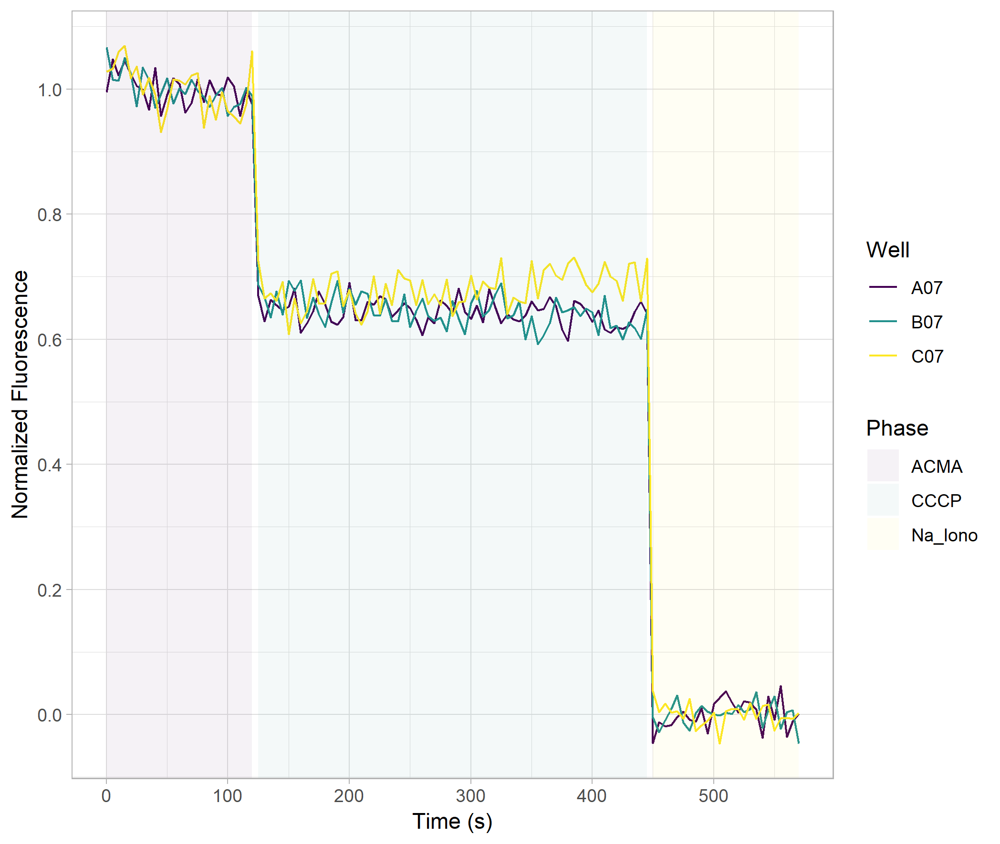

# Plate Reader Reader

The Mandel lab plate reader exports data in a near-useless format. Each plate is printed, in
its entirety, with a time stamp left of the first row. Plates are exported even when the
read is aborted early and those time points are not read. Moreover, different reagent runs are
split by plate. This all makes it very annoying to manually collect these data.

This set of scripts collects and visualizes kinetic data from the plate reader. It is designed
for a flux assay but could easily accommodate anything. The python script reads a `.txt` file from
the designated directory and converts it to a `.csv`, with a `Time` column in seconds, a `Sample`
column (which is filled in with flux assay reagents, but really is just a per-plate string, you can
set it how you like) and a column for each well (A1 -- H12), most of which will likely be entirely NaN.
Then it runs the R script.

The R script drops any entirely empty columns, then plots each well in a standard format. First, the
`ACMA` samples are averaged and that mean is set to 1.0. Next, the average `Na_Iono` fluorescence is set to 0.0.
Then each well gets a line tracing the points and that plot is saved. It'll likely take some changing
before it's publication ready, but it can go in your notebook.

You can use the -s flag to give a list of wells and samples to rename and average them so you
don't have to do any R work yourself. For instance, `assemble_flux.py -s A01 sample1
A02 "Sample 2"` will rename the A01 column to `sample1` and the A02 column to `Sample 2`. Samples
with the same name will be averaged. **Underscores are converted to dashes (_ --> -)**

If you're not performing a sodium flux assay (3 plates; ACMA, CCCP, Na ionophore) you can specify an
arbitrary number of plates with the -p flag. For instance, `assemble_flux.py -p ACMA CCCP Na_Iono` will
generate the standard flux plates. You can go over 3, but if you don't have that many plates they
obviously won't be used for anything.
